.. __How to download The Code:

How to download The Code
=======================

Drag and drop the .hex file directly onto the MicroBit motherboard.
-------------------------------

Connect your micro:bit drive to your computer via USB, click the computer icon, and drag and drop the prepared .hex file directly into the micro:bit drive.
Download `code files <https://github.com/lafvintech/LAFVIN_MBIT/archive/refs/heads/HexFile.zip>`_

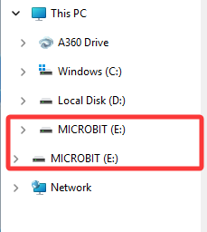

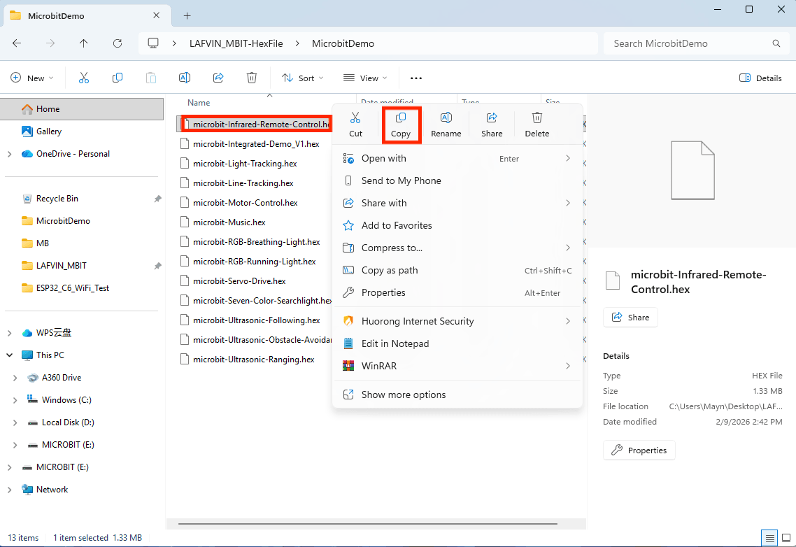

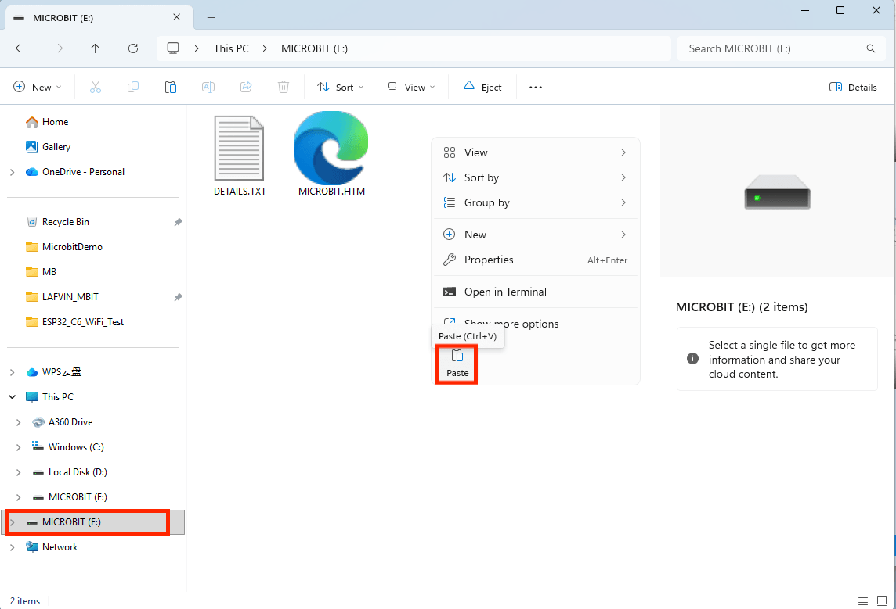

Download online via MakeCode
--------------

What is MakeCode?
^^^^^^^^

MakeCode is a free graphical programming platform developed by Microsoft. It teaches programming basics to children and beginners by dragging and dropping blocks. It is mainly used in conjunction with educational hardware such as micro:bit and Circuit Playground. It supports real-time simulation and JavaScript/Python code conversion and is widely used in maker education in primary and secondary schools.

How to use MakeCode
^^^^^^^^
1. Connect the micro:bit to your computer via USB, click the computer icon, and then click the URL on the micro:bit drive to access the programming interface.

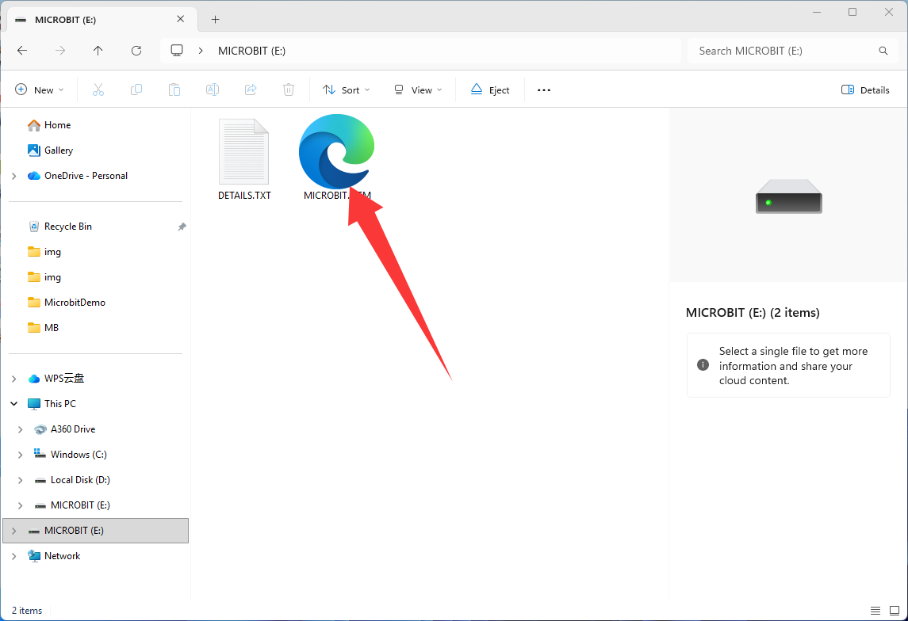

1. Open the MakeCode programming interface for micro:bit: `https://makecode.microbit.org/ <https://makecode.microbit.org/>`_

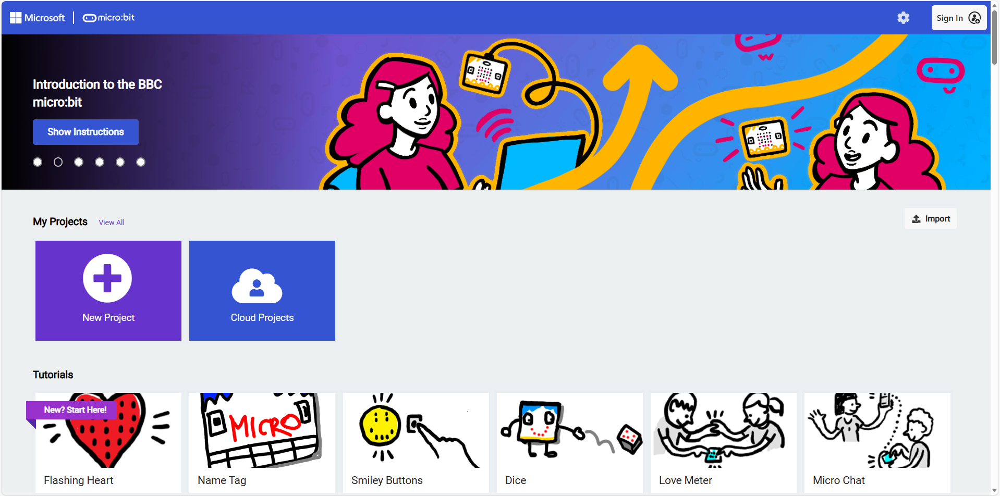

3. Click "New Project" to create a new project, and you can start programming the car.

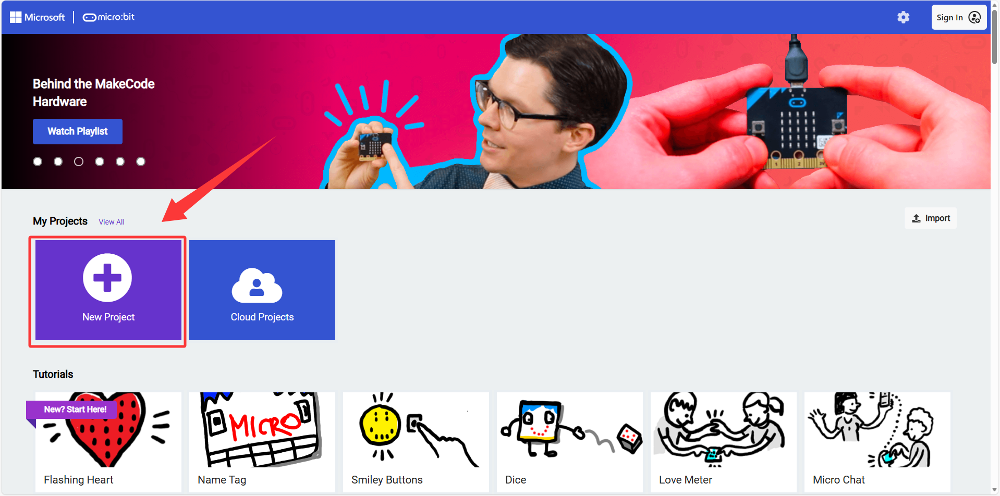

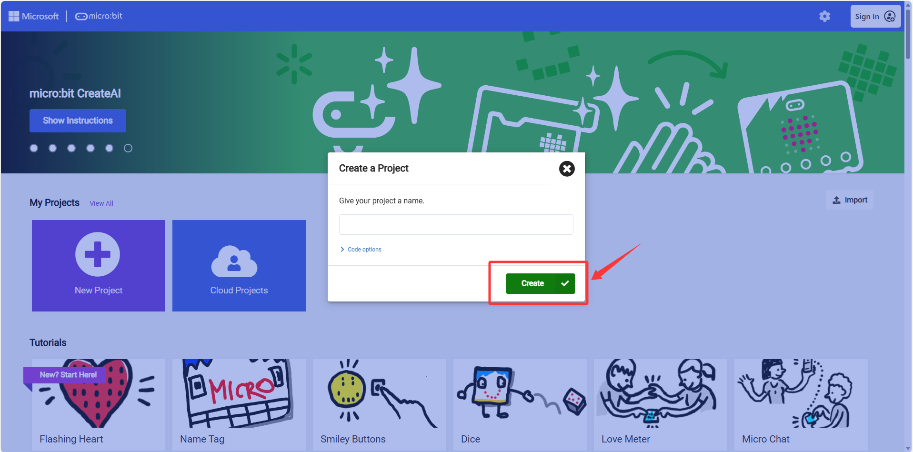

4. The interface allows you to switch between different programming languages, and the blocks you've already written will be converted into the corresponding programming language.

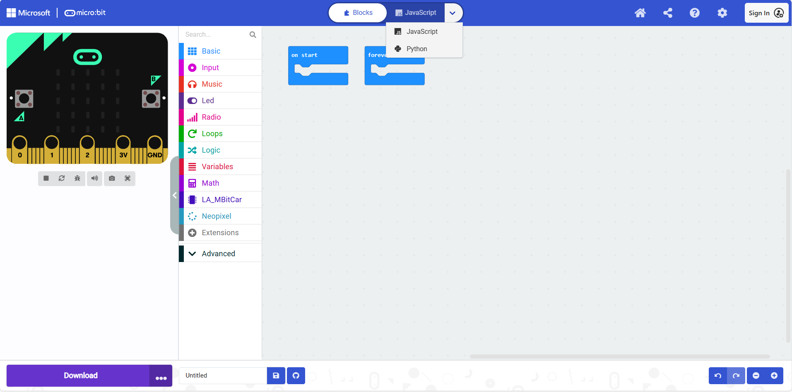

5. After writing the code, click the "Download" button to download the .hex file, and then drag and drop it into the micro:bit drive.If device pairing has been performed, online downloading is also possible.
   
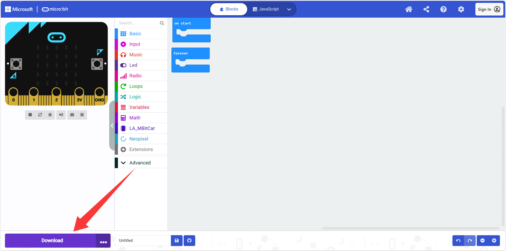

Import makecode graphical library
^^^^^^^^

If you choose to program the car yourself, the blocks that come with MakeCode may not meet your needs, in which case you will need to import extension libraries.

1. Click the "Expand" option in the module area.
2. In the pop-up window, enter the URL of the extension library to be imported in.
   To import the LAFVIN Micro:bit Smart Car Kit Library, please enter the following URL: `https://github.com/lafvintech/LAFVIN_MBIT.git <https://github.com/lafvintech/LAFVIN_MBIT.git>`_
3. Click to expand the library: LAFVIN, and you can use the blocks in this library to program the car.

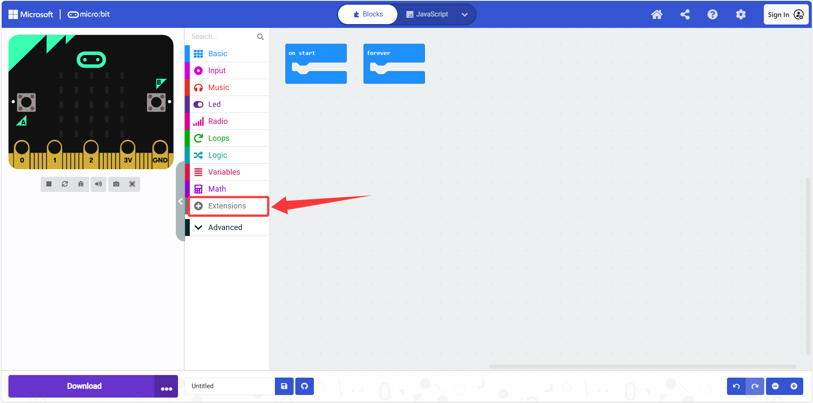

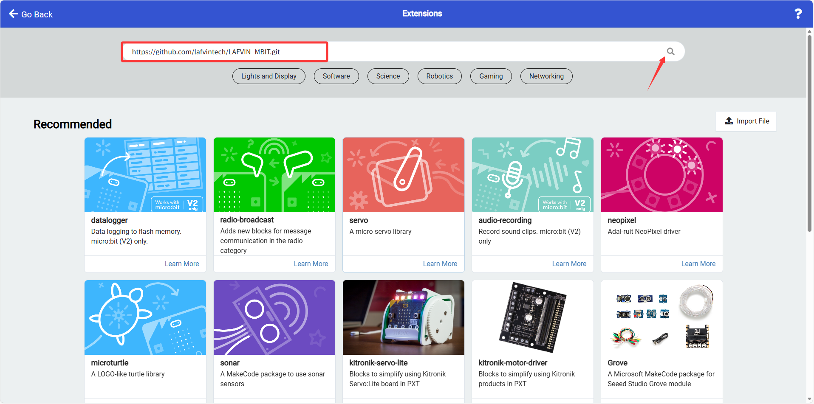

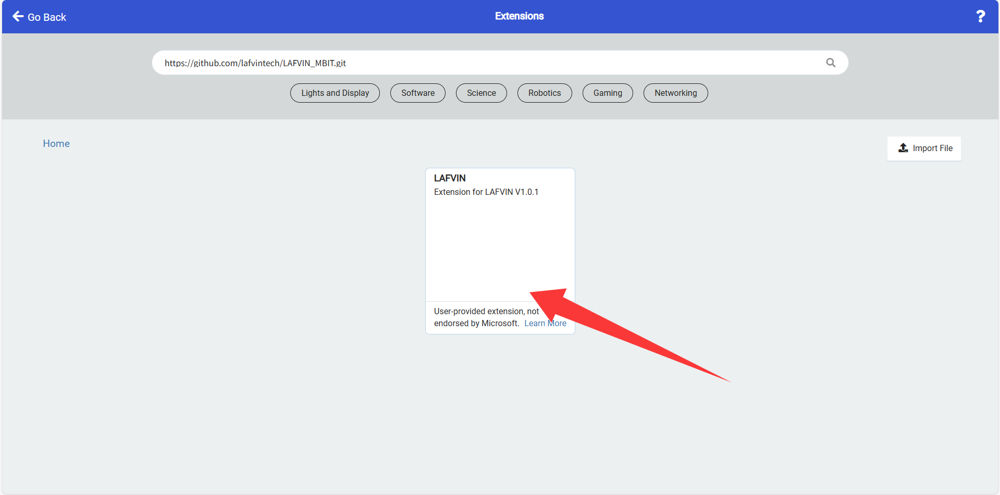

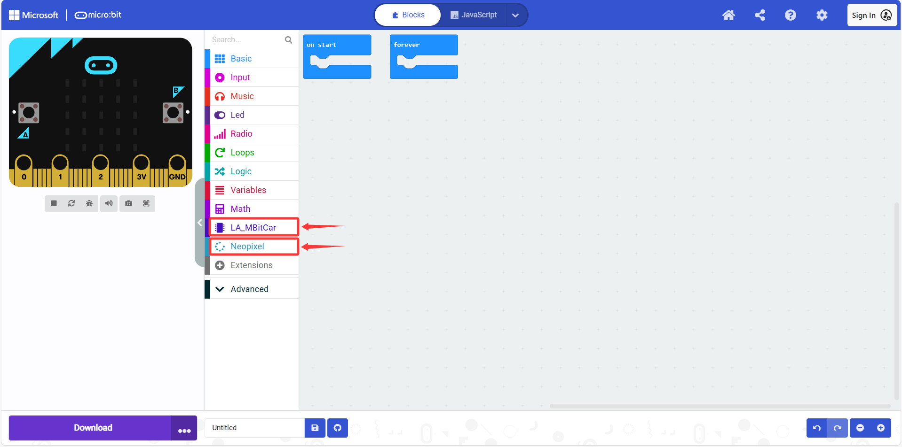

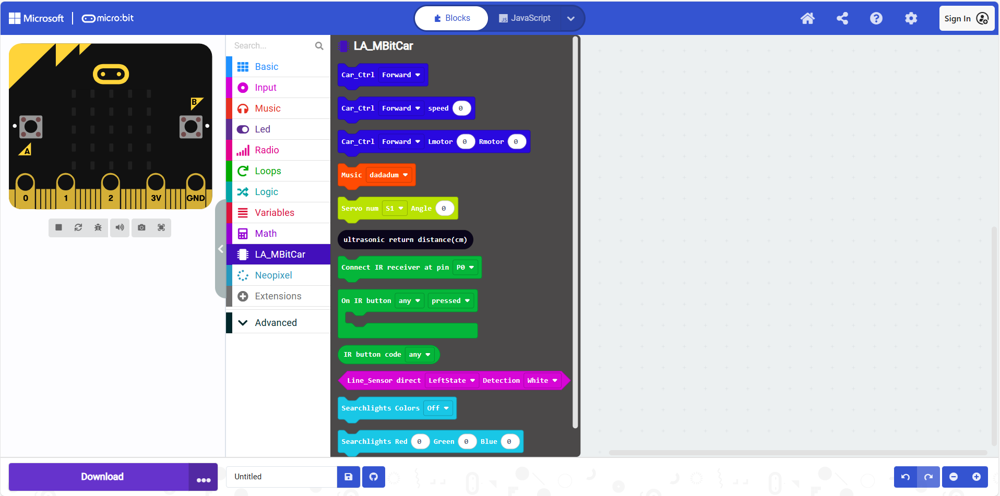

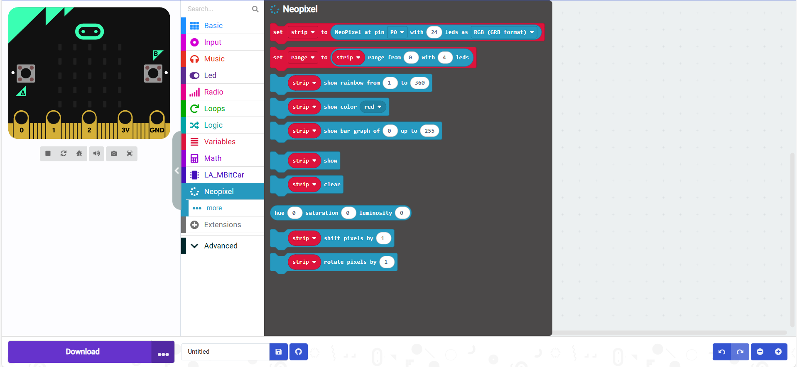

If you find any errors in the imported extensions, you can do the following:

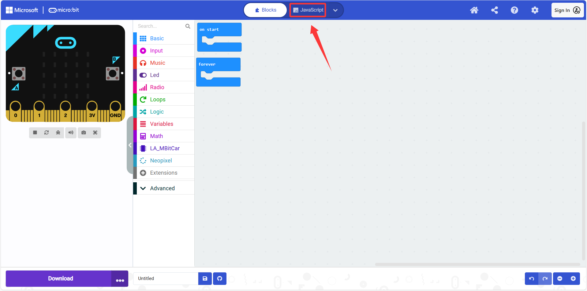

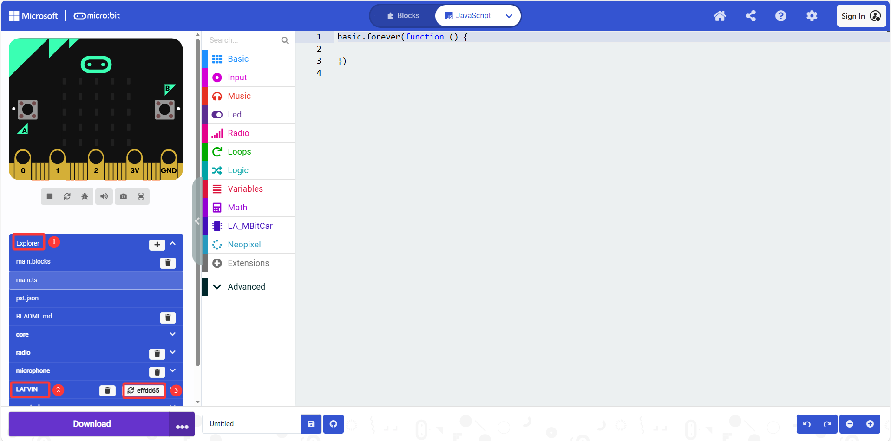

Refresh the page to match the version in the GitHub repository and then reopen your browser.

.. tip:: If you use the programming example links or Hex files we provide, the extensions will be added automatically.

