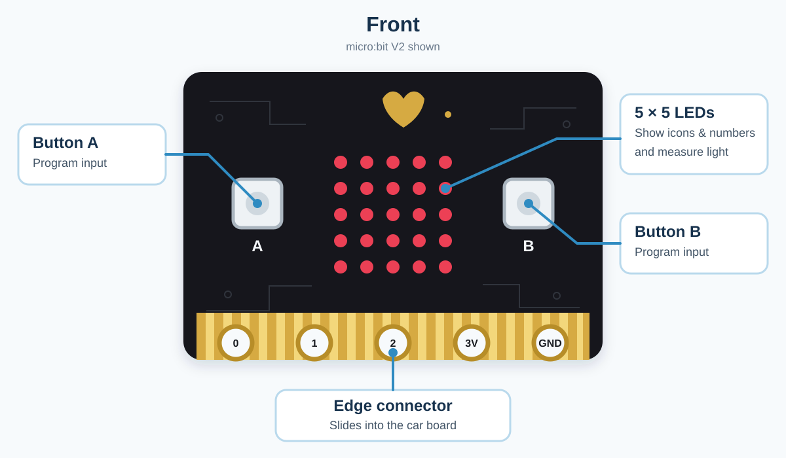
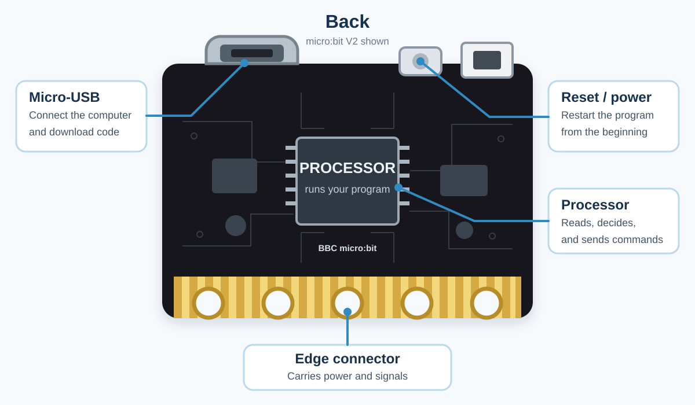

.. _basic_knowledge:

Basic Knowledge
===============

.. tip::

   If you already know these basics, or you want to get the car moving first
   and learn the details later, you can skip this chapter and go directly to
   :doc:`Programming Examples <Upload Code/Programming Examples>`.

Welcome, Young Engineer!
------------------------

This chapter explains the basic knowledge used in this tutorial, including
how the car gets power, reads sensors, moves, and follows a program.

Think of the smart car as a small robot driver:

* The **micro:bit** is the driver. It reads the controls and sensor values,
  makes choices, and sends commands to the other parts.
* The **light sensor** is a brightness meter. It tells the driver whether the
  surroundings are bright enough to move toward the light.
* The two **line sensors** are downward-looking track eyes. They tell the
  driver whether the left and right sides are over black or white.
* The **ultrasonic sensor** is a forward-looking measuring tape. It measures
  how far away an obstacle is so the car can avoid or follow it.
* The **infrared receiver** is the remote-control messenger. It tells the
  driver which remote button was pressed.
* The **motors** are the driving legs. They move the car forward or backward,
  turn it, spin it, and stop it.
* The **servo** is a movable joint. It turns the attached part to a chosen
  angle, such as ``0``, ``90``, or ``180`` degrees.
* The **LED display, searchlights, RGB lights, and buzzer** are the car's
  display board and voice. They show icons, numbers, and colors or play notes
  and melodies.
* The **program** is the driver's task list. Events, loops, and conditions
  tell it when to read, decide, move, light up, or make a sound.
* The **battery** is the car's energy tank. It supplies the power needed by
  the micro:bit, sensors, motors, servo, lights, and buzzer.

.. tip::

   Build and test one small idea at a time. Making mistakes is a normal part
   of learning to program.

1. Meet the micro:bit
---------------------

The micro:bit is a small computer. It can read information, make decisions,
and send commands to the car.

Start with the parts that appear in this tutorial:

   **Front:** Buttons A and B are inputs. The 5 x 5 LEDs show icons and
   numbers, and the display also measures the light level. The gold edge
   connector slides into the car board.

   **Back:** The Micro-USB socket receives a program from the computer. The
   processor runs that program, and the reset button starts it again from the
   beginning. The edge connector carries power and signals between the
   micro:bit and the car.

.. note::

   The pictures show a **micro:bit V2**. A V1 board looks slightly different,
   but it has the same buttons, LED display, Micro-USB socket, reset button,
   and edge connector used in this tutorial.

2. From micro:bit Pins to Car Ports
------------------------------------

The gold strips along the bottom of the micro:bit are called **pins**. When
you slide the micro:bit into the car board, its edge connector touches the
matching connector inside the slot. These contacts form the path that carries
power and signals between the micro:bit and the car.

You do not need to memorize every pin. Start with the labels that appear in
this tutorial:

.. list-table::
   :header-rows: 1
   :widths: 24 76

   * - Label
     - What it means here
   * - P0, P1, P2
     - General micro:bit signal pins available for connecting extra parts
   * - P8
     - The micro:bit pin used by the car's infrared receiver
   * - 3V3 (3.3 V)
     - The micro:bit's 3.3-volt power connection
   * - GND
     - The common electrical return connection
   * - S1, S2, S3
     - Servo ports on the **car board**, used to carry power and a control
       signal to a servo
   * - I2C
     - A port on the **car board** for compatible electronic parts that
       communicate using the SDA and SCL signal lines

The micro:bit pins and the car-board ports are related, but they are not the
same thing. The car board routes micro:bit signals to its motors, lights,
sensors, and labelled ports.

.. important::

   Insert the micro:bit in the direction shown in the assembly instructions.
   Always match the plug, port, direction, and voltage shown in the tutorial.
   **3V3 and 5V are not interchangeable.**

3. Powering the Car Safely
--------------------------

The battery gives the car energy. Before switching it on, remember three
simple rules:

#. Put the batteries into the holder in the direction shown by the ``+`` and
   ``-`` marks.
#. Push each power plug fully into the correct socket.
#. Use only the battery supply described in this tutorial.

This car needs **3.5 V to 5 V DC**. You can use three AAA dry-cell batteries
or the supported 3.6 V to 3.7 V lithium-battery supply described in this
tutorial. A higher-voltage battery will not simply make the car faster; it
can damage the electronics.

.. important::

   The kit includes a three-AAA battery box and an infrared remote control,
   but the **batteries and micro:bit board are not included**. They need to be
   prepared separately.

   A USB cable can power the micro:bit while you download code, but it does
   not provide enough power for the whole car and its motors. Use the car's
   battery supply when you test driving and other peripherals.

.. warning::

   * Ask an adult for help if a battery becomes hot, leaks, swells, smells
     strange, or looks damaged.
   * Never join the positive and negative battery ends directly with metal.
     This is called a **short circuit** and it can make the battery and wire
     very hot.
   * Switch off the car before plugging in or unplugging parts.

**Quick check:** If nothing turns on, first check the power switch, the battery
direction, and whether every power plug is firmly connected.

4. LEDs, RGB Colors, and the Buzzer
-----------------------------------

An **LED** is a small light that uses electricity efficiently. An **RGB LED**
contains red, green, and blue light sources. A program can control their
brightness to produce different colors.

The car has two different groups of colorful lights:

* Two RGB spotlights at the front work like colorful searchlights.
* Four WS2812 RGB LEDs on the bottom can be controlled one at a time. This is
  how the program creates running-light and breathing-light patterns.

The passive **buzzer** on the car board changes electrical signals into sound.
Higher-frequency signals make higher notes, and lower-frequency signals make
lower notes. The car board also has an audio switch. If your program is playing
notes but the buzzer is silent, check the position of this switch.

5. Motors: How the Car Moves
----------------------------

The car has two N20 geared motors: one drives the left wheel and one drives
the right wheel. The program controls each motor's direction and speed.

.. list-table::
   :header-rows: 1
   :widths: 30 35 35

   * - Car action
     - Left motor
     - Right motor
   * - Move forward
     - Forward
     - Forward
   * - Move backward
     - Backward
     - Backward
   * - Turn left
     - Slower or backward
     - Faster or forward
   * - Turn right
     - Faster or forward
     - Slower or backward
   * - Stop
     - Stop
     - Stop

Motor speed is controlled using **PWM**. PWM switches power on and off very
quickly. More “on time” gives the motor more average power, so it usually spins
faster. It happens too quickly for your eyes to see.

The car may move more slowly when it is carrying a load. Two motors may not
spin at exactly the same speed, even when their code values match. The battery
level, floor, wheel fit, and small differences between motors can change how
the car moves. Adjust the left or right speed a little if the car does not
travel straight.

.. warning::

   If a wheel is stuck, stop the motor before touching it. Do not hold a
   powered wheel still with your fingers.

6. Servo: A Motor That Points
-----------------------------

A normal wheel motor keeps spinning. A **servo** is different: it moves its
shaft to a requested angle and tries to hold that position.

The car board has three servo ports, named **S1**, **S2**, and **S3**. The kit
includes one SG90 servo. The servo used with the forklift can raise, lower, or
position a moving part. Its safe movement range depends on how it is installed.
Do not force it past a physical stop. If it buzzes, shakes, or cannot reach the
requested angle, switch off the power and check the assembly and angle
settings.

7. Sensors: How the Car Notices the World
-----------------------------------------

A sensor changes something in the real world into a value the program can
read.

Micro:bit light sensing
~~~~~~~~~~~~~~~~~~~~~~~

The micro:bit can estimate the light level using its LED display. A program
can compare that value with a chosen number and make the car react to brighter
or darker light.

Sensor readings are not magic “yes” or “no” answers. They are measurements.
Your program chooses a **threshold**, which is the dividing value between two
actions.

Infrared remote control
~~~~~~~~~~~~~~~~~~~~~~~

The car board has an infrared receiver, and the kit includes a handheld
infrared remote control. Batteries are not included. When you press a button,
the remote flashes a coded pattern of infrared light. People cannot see this
light, but the receiver can read it. The program connects each button signal
to an action such as moving, turning, or stopping.

Point the remote toward the receiver on the front of the car. A wall, a long
distance, or very strong sunlight may make the signal harder to receive.

Infrared line sensors
~~~~~~~~~~~~~~~~~~~~~

The two line sensors under the car shine infrared light toward the floor and
measure the reflected light. Light and dark surfaces reflect different
amounts, so the program can tell when a sensor is over a dark line.

For best results:

* Use a clear dark line on a light, plain surface.
* Keep strong sunlight away from the sensors when possible.
* Test whether the sensors detect the line correctly before trying to drive
  quickly.
* If detection is unstable, carefully adjust the blue potentiometer on the
  car board to change the sensors' sensitivity.

Ultrasonic sensor
~~~~~~~~~~~~~~~~~

The ultrasonic sensor measures distance using sound that is too high for
people to hear. It sends a short sound pulse and listens for the echo. A quick
echo means an object is nearby; a later echo means it is farther away.

It works a little like calling “hello” in a cave and listening for the echo.
Soft cloth, angled surfaces, very small objects, and moving objects can make
the reading less steady.

.. important::

   The kit can be built in different forms. The forklift assembly and the
   ultrasonic module use the same front area, so they cannot be installed
   there at the same time. Remove the forklift assembly before changing to
   the ultrasonic form. The shovel also blocks access to the ultrasonic and
   I2C area.

8. Input, Decision, and Output
------------------------------

Now that you know the car's sensors and moving, lighting, and sound parts, you
can connect them with a program. Most robot programs can be understood as
three steps:

.. list-table::
   :header-rows: 1
   :widths: 20 40 40

   * - Step
     - What happens
     - Car example
   * - Input
     - The robot receives information
     - The micro:bit measures the light level
   * - Decision
     - The program checks a rule
     - Is the light level at or above the chosen limit?
   * - Output
     - The robot does something
     - The motors move the car or stop it

The information follows this path:

``light sensor`` -> ``program checks the light level`` -> ``motors move or stop``

In block code, an ``if`` block lets the robot make a choice:

.. code-block:: text

   IF light level is at or above the chosen limit
       move forward
   ELSE
       stop

The robot is not frightened by the obstacle. It is simply following the rule
you wrote.

9. Loops, Variables, and Conditions
-----------------------------------

One decision only happens once. A robot usually needs to keep checking, so
programs also use loops, variables, and conditions:

Loop
   A loop repeats instructions. ``forever`` is a loop that keeps going until
   the micro:bit is switched off or reset.

Variable
   A variable is a named box that remembers a value. A variable called
   ``distance`` can remember the latest reading from the ultrasonic sensor.

Condition
   A condition is a question with only two answers: **true** or **false**.
   For example, ``distance < limit`` is true when the measured distance is
   below the chosen limit.

.. code-block:: text

   FOREVER
       set distance to the sensor reading
       IF distance is below the chosen limit
           stop
       ELSE
           move forward

This loop helps the car react when the world around it changes.

10. A Safe Way to Test Every Project
------------------------------------

Use this short routine whenever you try new code:

#. **Check the build.** Are the wheels free to turn? Are the plugs in the
   correct ports?
#. **Lift the driving wheels.** For the first motor test, keep them off the
   table so the car cannot race away.
#. **Start small.** Test one light, motor, or sensor before combining many
   parts.
#. **Use a slow speed.** Increase it only after the direction is correct.
#. **Watch and listen.** Stop if a part becomes hot, smells strange, jams, or
   makes an unusual sound.
#. **Change one thing.** Run the test again so you know what caused the new
   result.

11. When It Does Not Work: Be a Code Detective
-----------------------------------------------

Do not change everything at once. Ask these questions in order:

#. **Power:** Is the switch on? Do the batteries have enough power, and are
   they facing the right way?
#. **Program:** Did the ``.hex`` file finish copying to the micro:bit?
#. **Connection:** Is each plug fully inserted into the correct port?
#. **Start block:** Is the important code inside ``on start``, ``forever``, or
   the correct event?
#. **Value:** Is a speed set to zero? Is a distance or angle value sensible?
#. **Direction:** Is a motor or sensor connected in the expected direction?
#. **One-part test:** Does the part work in a tiny program by itself?

Use the micro:bit display as a detective tool. Show a number, icon, or letter
at important points in your program. If the symbol appears, you know the
program reached that point.

12. Tiny Dictionary
-------------------

.. glossary::

   Algorithm
      A clear set of steps used to complete a task.

   Bug
      A mistake in a program or setup that causes an unexpected result.

   Code
      Instructions written for a computer.

   Debug
      To find and fix the cause of a problem.

   Hardware
      Physical parts you can touch, such as the micro:bit, motor, and sensor.

   Program
      A complete set of code that a computer can run.

   Reset
      To make the micro:bit stop the current run and start its program again.

   Sensor
      A part that measures something and sends a value to the program.

   Software
      Programs and digital tools, such as MakeCode.

   Threshold
      A chosen dividing value used to decide between two actions.

You are now ready to try the **Programming Examples**. Start with motor control
or lights, then move on to sensor projects when those first tests work.
