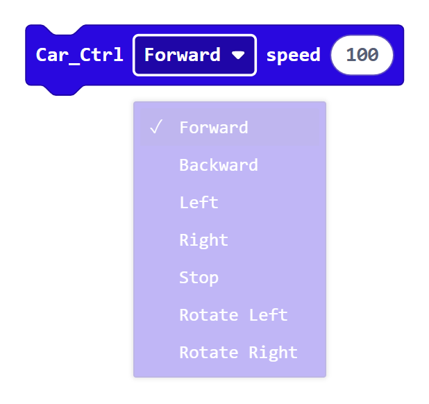
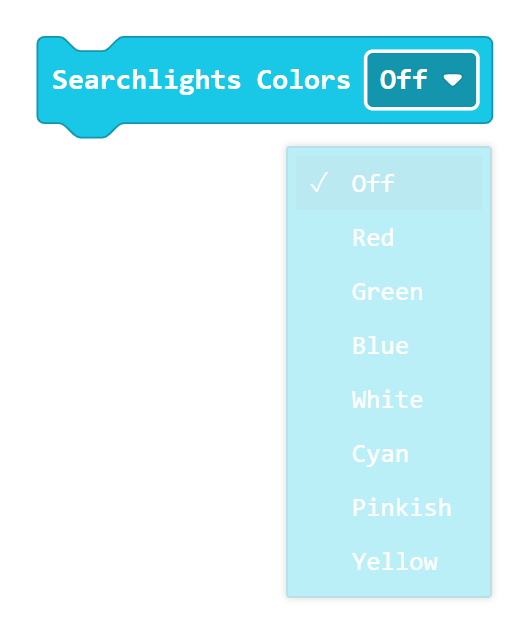
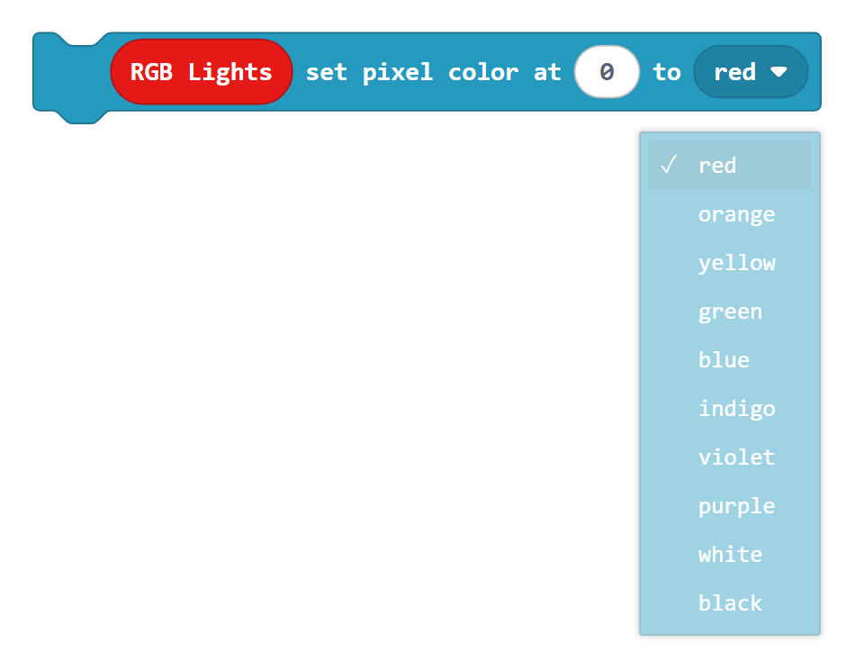
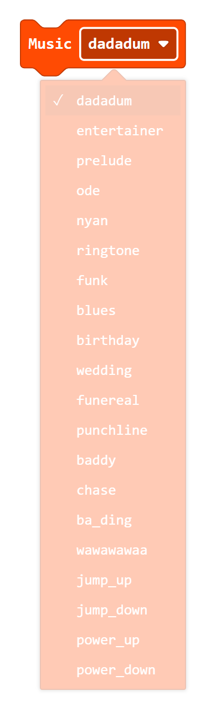
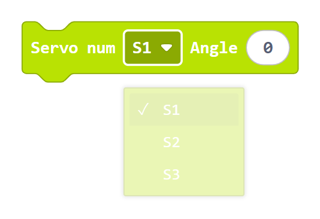
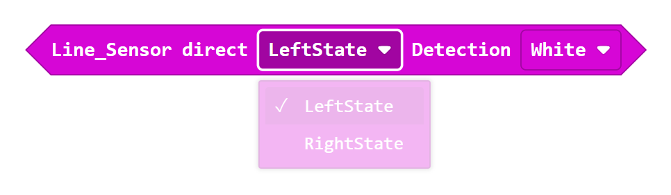
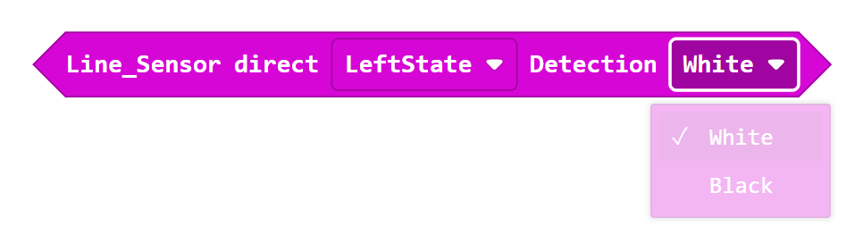
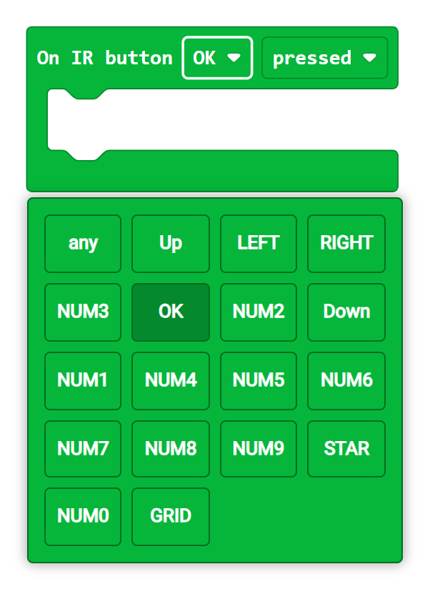
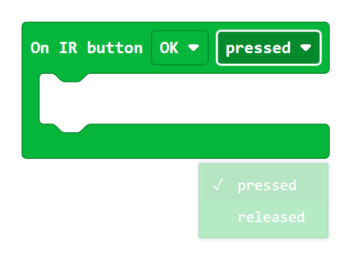

.. _block_reference:

Meet the Car Blocks
===================

The **LA_MBitCar** blocks help your micro:bit control the smart car.
You can make the car move, light up, play music, and read sensors.

Before You Start
----------------

* Find an **outlined field** with a down arrow.
* Click it to open the menu shown under the block.
* Click a **white number** to change its value.

1. Make the Car Move
--------------------

   Click ``Forward`` to open all seven direction choices.

Choose a direction:

* ``Forward`` or ``Backward`` moves the car straight.
* ``Left`` or ``Right`` makes a turn.
* ``Rotate Left`` or ``Rotate Right`` spins the car.
* ``Stop`` stops both wheels.

Speed can be set from ``0`` to ``255``.

2. Change the Front Lights
--------------------------

   Click ``Off`` to open all eight front-light choices.

Choose ``Red``, ``Green``, ``Blue``, ``White``, ``Cyan``, ``Pinkish``,
``Yellow``, or ``Off``.

3. Change the Lights Under the Car
----------------------------------

   Click the color field to open all ten color choices.

The four lights under the car are numbered ``0``, ``1``, ``2``, and ``3``.
Choose a number to change one light.

Remember the two steps:

#. Set the pixel color.
#. Use ``show``.

4. Play Music
-------------

   Click ``dadadum`` to see every built-in melody.

Choose a melody, and the car plays it once.

If you cannot hear anything, check the audio switch on the car board.

5. Move a Servo
---------------

   Click ``S1`` to choose the servo socket.

Choose ``S1``, ``S2``, or ``S3`` to match the socket used by the servo.
The angle can be from ``0`` to ``180`` degrees.

6. ad the Line Sensors
------------------------

   First click ``LeftState`` to choose the left or right sensor.

   Then click ``White`` to choose a white or black surface.

The answer is either **true** or **false**, so this block fits inside an
``if`` block. A line-following program checks both sensors again and again.

7. Measure Distance
-------------------

   This block reports the distance in centimeters.

Put it inside ``show number`` to see the distance on the micro:bit display.
You can also compare the distance with a number to help the car avoid an
obstacle.

A result of ``0`` usually means that the sensor did not receive a clear echo.

8. Use the Remote Control
-------------------------

   Click ``OK`` to see every button on the remote.

   Click ``pressed`` to choose ``pressed`` or ``released``.

Put ``Connect IR receiver at pin P8`` inside ``on start``.

Next, add an ``On IR button`` event:

#. Choose a remote button.
#. Choose ``pressed`` or ``released``.
#. Put a car, light, music, or servo block inside the event.

Point the remote toward the receiver when you test it.

Continue to :doc:`Programming Examples <Upload Code/Programming Examples>` when
you are ready to combine several blocks.
