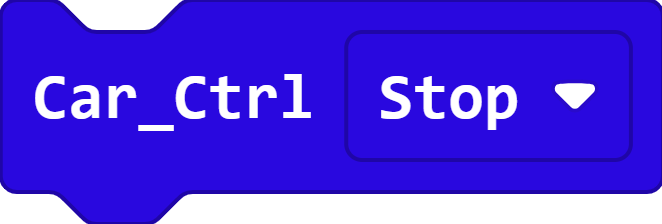

.. _block_reference:

LAFVIN Extension Blocks
=======================

The **LA_MBitCar** blocks help your micro:bit control the smart car.
You can make the car move, light up, play music, and read sensors.

.. important::

   These blocks are **not included in a new MakeCode project**. They appear
   only after you add the LAFVIN car extension. For blocks that are already
   built into MakeCode, see :doc:`MakeCode Built-in Blocks`.

Before You Start
----------------

* Find an **outlined field** with a down arrow.
* Click it to open the menu shown under the block.
* Click a **white number** to change its value.

1. Make the Car Move
--------------------

.. figure:: ./block_reference/img/car-control.png
   :align: center
   :width: 50%
   :alt: Car control block with its direction menu open

   Click ``Forward`` to open all seven direction choices.

Choose a direction:

* ``Forward`` or ``Backward`` moves the car straight.
* ``Left`` or ``Right`` makes a turn.
* ``Rotate Left`` or ``Rotate Right`` spins the car.
* ``Stop`` stops both wheels.

Speed can be set from ``0`` to ``255``.

Stop the car without a speed
~~~~~~~~~~~~~~~~~~~~~~~~~~~~

This shorter ``Car_Ctrl Stop`` block stops the car. It has no speed input
because stopping always sets both N20 motors to zero.

2. Change the Colored Searchlights
----------------------------------

.. figure:: ./block_reference/img/searchlights.png
   :align: center
   :width: 44%
   :alt: Searchlight block with its color menu open

   Click ``Off`` to open all eight colored-searchlight choices.

Choose ``Red``, ``Green``, ``Blue``, ``White``, ``Cyan``, ``Pinkish``,
``Yellow``, or ``Off``.

3. Change the WS2812 RGB Lights
-------------------------------

.. important::

   The blocks in this section appear in the **Neopixel** category. The LAFVIN
   extension installs that category automatically because the four **WS2812
   RGB lights** under the Smart Car board use NeoPixel LEDs. They are not
   included in a new MakeCode project before the LAFVIN extension is added.

Select the four WS2812 RGB lights
~~~~~~~~~~~~~~~~~~~~~~~~~~~~~~~~~

The red ``RGB Lights`` value block represents the four WS2812 RGB lights under
the Smart Car board. Its rounded shape fits into the red socket of each
NeoPixel action block below.

Set one light's color
~~~~~~~~~~~~~~~~~~~~~

.. figure:: ./block_reference/img/rgb-lights-basic.png
   :align: center
   :width: 68%
   :alt: RGB light block with its color menu open

   Click the color field to open all ten color choices.

The four WS2812 RGB lights under the Smart Car board are numbered ``0``, ``1``,
``2``, and ``3``.
Choose a number to change one light. The color menu contains ``red``,
``orange``, ``yellow``, ``green``, ``blue``, ``indigo``, ``violet``,
``purple``, ``white``, and ``black``.

This block changes a stored color. Use ``show`` to send that change to the
real lights.

Show the stored colors
~~~~~~~~~~~~~~~~~~~~~~

``show`` sends all stored pixel colors to the four WS2812 RGB lights. Use it after one
or more ``set pixel color`` blocks.

Show one color on all four lights
~~~~~~~~~~~~~~~~~~~~~~~~~~~~~~~~~

``show color`` changes all four WS2812 RGB lights at once and displays the selected
color immediately. Its color field provides the same ten choices shown in
the ``set pixel color`` menu.

Change the brightness
~~~~~~~~~~~~~~~~~~~~~

``set brightness`` controls how bright the WS2812 RGB lights appear. Use a value
from ``0`` for off to ``255`` for maximum brightness.

Clear the stored colors
~~~~~~~~~~~~~~~~~~~~~~~

``clear`` changes every stored pixel color to black. Use ``show`` afterward
when the cleared result must be sent to WS2812 RGB lights that are already on.

4. Play Music
-------------

.. figure:: ./block_reference/img/music.png
   :align: center
   :width: 32%
   :alt: Music block with its melody menu open

   Click ``dadadum`` to see every built-in melody.

Choose a melody, and the car plays it once.

If you cannot hear anything, check the audio switch on the Smart Car board and
make sure the passive buzzer is enabled.

5. Control the SG90 Servo
-------------------------

.. figure:: ./block_reference/img/servo.png
   :align: center
   :width: 52%
   :alt: Servo block with its socket menu open

   Click ``S1`` to choose a position on the servo interface.

Choose ``S1``, ``S2``, or ``S3`` to match the servo-interface position used by
the SG90 servo.
The angle can be from ``0`` to ``180`` degrees.

6. Read the Line-following Sensors
----------------------------------

.. figure:: ./block_reference/img/line-direction.png
   :align: center
   :width: 72%
   :alt: Choose the left or right line-following sensor

   First click ``LeftState`` to choose the left or right line-following sensor.

.. figure:: ./block_reference/img/line-surface.png
   :align: center
   :width: 72%
   :alt: Choose a white or black surface

   Then click ``White`` to choose a white or black surface.

The answer is either **true** or **false**, so this block fits inside an
``if`` block. A line-following program checks both sensors again and again.

7. Measure Distance with the HC-SR04 Ultrasonic Module
-------------------------------------------------------

.. figure:: ./block_reference/img/ultrasonic.png
   :align: center
   :width: 52%
   :alt: Ultrasonic distance block

   This block reports the distance in centimeters.

Put it inside ``show number`` to see the HC-SR04 ultrasonic-module distance on
the micro:bit display.
You can also compare the distance with a number to help the car avoid an
obstacle.

A result of ``0`` usually means that the HC-SR04 ultrasonic module did not
receive a clear echo.

8. Use the Remote Control
-------------------------

Connect the infrared receiver
~~~~~~~~~~~~~~~~~~~~~~~~~~~~~

Put ``Connect IR receiver at pin P8`` inside ``on start`` so the micro:bit
begins listening for remote-control signals. The infrared receiver on this
Smart Car board is connected to pin ``P8``.

Choose a remote button
~~~~~~~~~~~~~~~~~~~~~~

.. figure:: ./block_reference/img/ir-button.png
   :align: center
   :width: 46%
   :alt: Infrared remote button choices

   Click ``OK`` to see every button on the remote.

.. figure:: ./block_reference/img/ir-action.png
   :align: center
   :width: 48%
   :alt: Infrared button action choices

   Click ``pressed`` to choose ``pressed`` or ``released``.

Add an ``On IR button`` event:

#. Choose a remote button.
#. Choose ``pressed`` or ``released``.
#. Put a car, light, music, or servo block inside the event.

Point the infrared remote control toward the infrared receiver when you test it.

Continue to :doc:`Programming Examples <Upload Code/Programming Examples>` when
you are ready to combine several blocks.
