.. _makecode_built_in_blocks:

Official MakeCode Blocks
========================

This page explains the official MakeCode blocks used by the supplied
programs. Each block is introduced on its own. How several blocks are combined
is explained separately in :doc:`Programming Examples <Upload
Code/Programming Examples>`.

.. important::

   Official blocks are available in a new micro:bit MakeCode project without
   installing an extension. Blocks that directly control the car are listed
   separately in :doc:`LAFVIN Extension Blocks <Block Reference>`.

1. Basic
--------

``on start``
~~~~~~~~~~~~

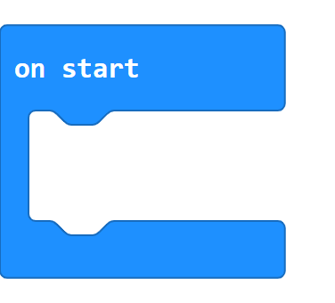

``on start`` runs once when the micro:bit starts or is reset. Put preparation
steps inside its open space. MakeCode provides one ``on start`` block for the
main program.

``forever``
~~~~~~~~~~~

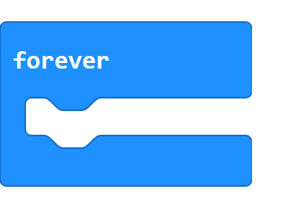

``forever`` repeats the blocks inside its open space until the micro:bit is
reset or switched off. It is used when a program must keep checking or
updating something.

``show icon``
~~~~~~~~~~~~~

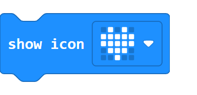

``show icon`` draws a picture on the micro:bit's 5 by 5 LED display. Click the
picture or down arrow to choose another built-in icon.

``show number``
~~~~~~~~~~~~~~~

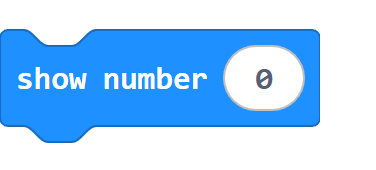

``show number`` displays a number on the micro:bit. A single digit appears at
once; a longer number scrolls across the LED display. Replace the white number
with another number-producing block when needed.

``pause (ms)``
~~~~~~~~~~~~~~

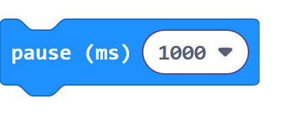

``pause (ms)`` waits before the next block runs. The value is measured in
milliseconds: ``1000`` milliseconds equals one second.

``clear screen``
~~~~~~~~~~~~~~~~

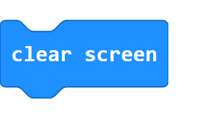

``clear screen`` turns off every light on the micro:bit's LED display. It does
not stop the rest of the program.

2. Input
--------

``on button pressed``
~~~~~~~~~~~~~~~~~~~~~

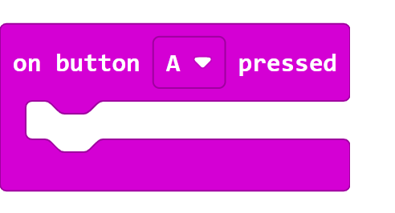

This event block runs the blocks inside it after a button is pressed. Use its
dropdown to choose button ``A``, button ``B``, or ``A+B``.

``light level``
~~~~~~~~~~~~~~~

``light level`` reports a number from ``0`` for dark to ``255`` for bright.
Its rounded shape shows that it produces a value and fits inside another
block's rounded input.

3. Loops
--------

``repeat``
~~~~~~~~~~

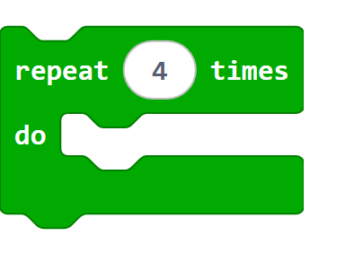

``repeat`` runs the blocks inside it a fixed number of times. Change the white
number to choose the number of repetitions.

``for index from ... to ...``
~~~~~~~~~~~~~~~~~~~~~~~~~~~~~

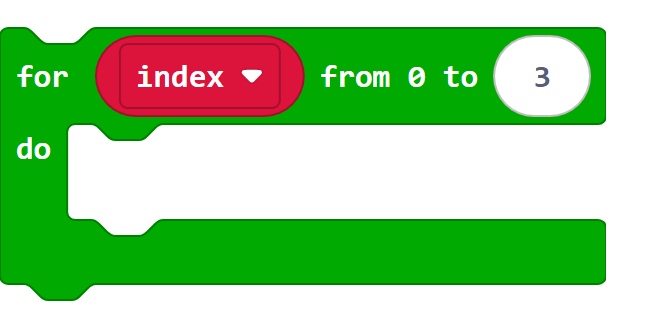

This loop counts from a starting number to an ending number. The variable
``index`` holds the current count and changes once on every pass. Both end
numbers are included.

4. Logic
--------

``if / else``
~~~~~~~~~~~~~

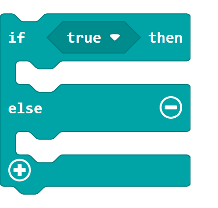

``if`` checks a true-or-false condition. The first open space runs when the
condition is true; ``else`` runs when it is false. The plus and minus buttons
add or remove branches.

Comparison
~~~~~~~~~~

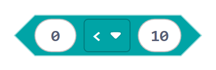

A comparison checks two values and reports ``true`` or ``false``. Use the
middle dropdown to choose equal to, not equal to, less than, less than or
equal to, greater than, or greater than or equal to.

``and``
~~~~~~~

``and`` reports true only when both conditions are true. Change the middle
dropdown to ``or`` when only one of the two conditions needs to be true.

5. Variables and Math
---------------------

``set variable to``
~~~~~~~~~~~~~~~~~~~

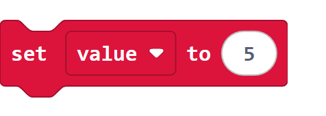

``set variable to`` stores a value in the selected variable. A new set
operation replaces the value that was stored before it.

``change variable by``
~~~~~~~~~~~~~~~~~~~~~~

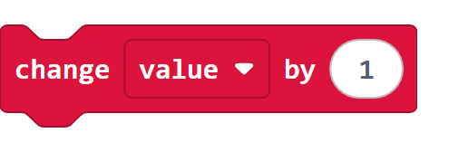

``change variable by`` adds an amount to the current value. Use a negative
amount, such as ``-1``, to subtract.

Variable value
~~~~~~~~~~~~~~

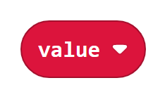

The rounded variable block reports the value currently stored in that
variable. Use its dropdown to choose a different variable.

Subtraction
~~~~~~~~~~~

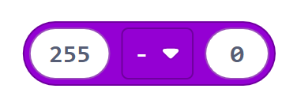

This Math block subtracts the right-hand number from the left-hand number and
reports the result. Its middle dropdown can select another arithmetic
operation.

6. Music
--------

``play tone ... for ... beat``
~~~~~~~~~~~~~~~~~~~~~~~~~~~~~~

This block plays one musical note. Choose the pitch, beat length, and playback
mode with its three fields. ``until done`` waits for the note to finish before
the next block runs.

Continue with :doc:`LAFVIN Extension Blocks <Block Reference>` for the
car-specific blocks, or open :doc:`Programming Examples <Upload
Code/Programming Examples>` to see complete programs.
