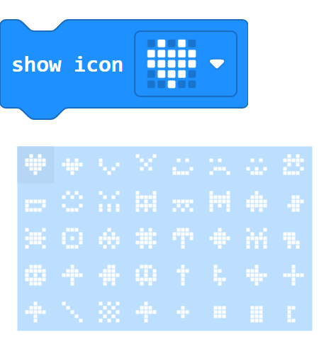
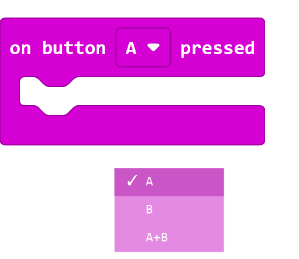
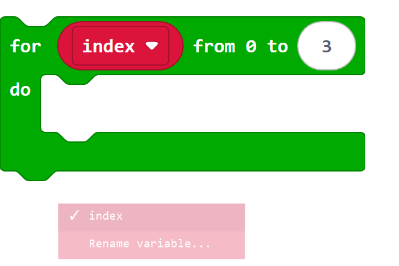
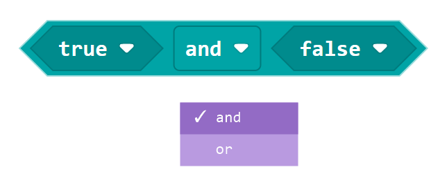
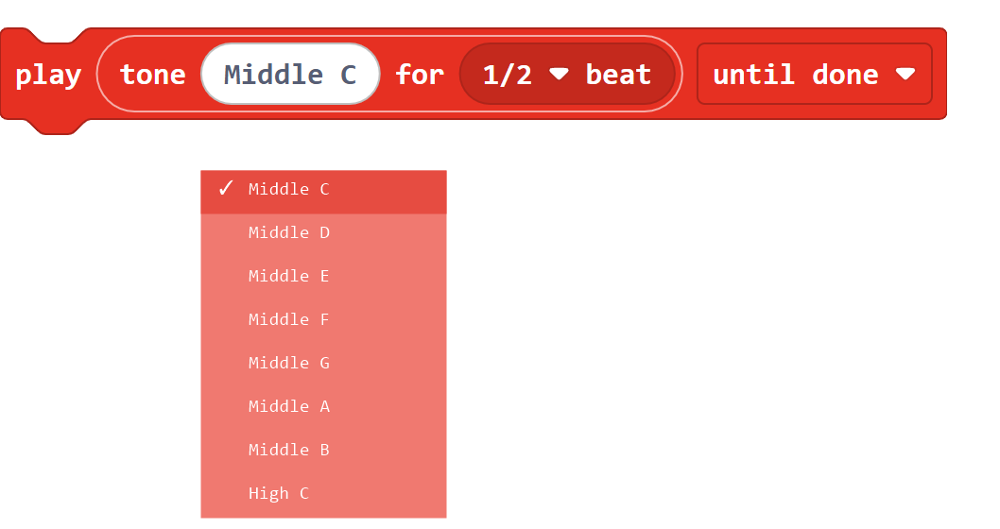
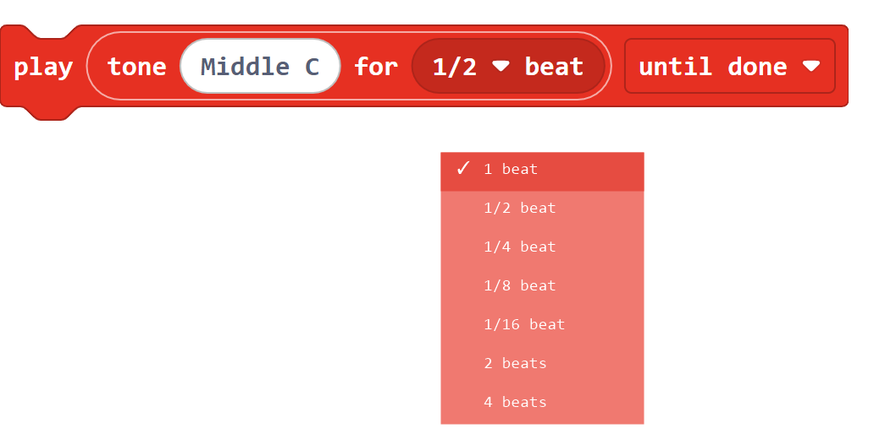
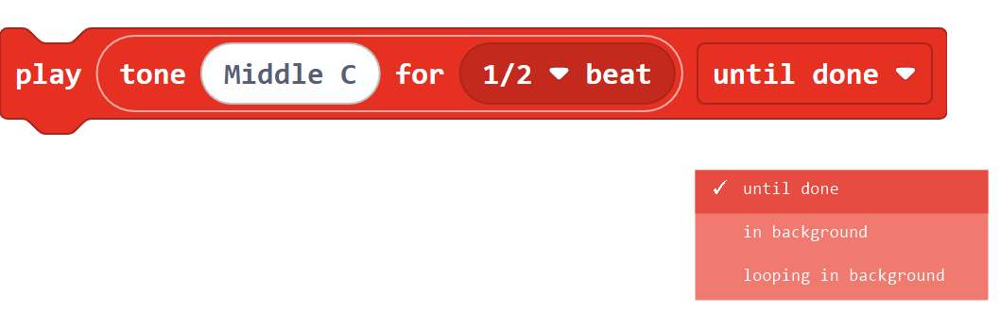

.. _makecode_built_in_blocks:

Official MakeCode Blocks
========================

This page explains the official MakeCode blocks used by the supplied
programs. Each block is introduced on its own. How several blocks are combined
is explained separately in :doc:`Programming Examples <Upload
Code/Programming Examples>`.

.. important::

   Official blocks are available in a new micro:bit MakeCode project without
   installing an extension. Blocks that directly control the car are listed
   separately in :doc:`LAFVIN Extension Blocks <Block Reference>`.

Before You Start
----------------

* Click a field with a **down arrow** to open the choices shown below the block.
* The picture inside ``show icon`` also opens a picture menu.
* Click a **white number** to type a value. A white number is not a dropdown.

1. Basic
--------

``on start``
~~~~~~~~~~~~

.. figure:: ./block_reference/official/on-start.png
   :align: center
   :width: 34%
   :alt: MakeCode on start block

``on start`` runs once when the micro:bit starts or is reset. Put preparation
steps inside its open space. MakeCode provides one ``on start`` block for the
main program.

``forever``
~~~~~~~~~~~

.. figure:: ./block_reference/official/forever.png
   :align: center
   :width: 34%
   :alt: MakeCode forever block

``forever`` repeats the blocks inside its open space until the micro:bit is
reset or switched off. It is used when a program must keep checking or
updating something.

``show icon``
~~~~~~~~~~~~~

   Click the picture to open the built-in icon menu.

``show icon`` draws the selected 5 by 5 picture on the micro:bit LED display.
The menu contains hearts, faces, animals, objects, music symbols, arrows, and
simple shapes. The highlighted picture is the one that the block will show.

``show number``
~~~~~~~~~~~~~~~

.. figure:: ./block_reference/official/show-number.png
   :align: center
   :width: 38%
   :alt: MakeCode show number block

``show number`` displays a number on the micro:bit. A single digit appears at
once; a longer number scrolls across the LED display. Replace the white number
with another number-producing block when needed.

``pause (ms)``
~~~~~~~~~~~~~~

.. figure:: ./block_reference/official/pause.png
   :align: center
   :width: 42%
   :alt: MakeCode pause block

``pause (ms)`` waits before the next block runs. The value is measured in
milliseconds: ``1000`` milliseconds equals one second.

``clear screen``
~~~~~~~~~~~~~~~~

.. figure:: ./block_reference/official/clear-screen.png
   :align: center
   :width: 34%
   :alt: MakeCode clear screen block

``clear screen`` turns off every light on the micro:bit's LED display. It does
not stop the rest of the program.

2. Input
--------

``on button pressed``
~~~~~~~~~~~~~~~~~~~~~

   Click ``A`` to choose which button starts the event.

This event block runs the blocks inside it after the selected button is
pressed:

* ``A`` listens for the left button.
* ``B`` listens for the right button.
* ``A+B`` listens for both buttons pressed together.

``light level``
~~~~~~~~~~~~~~~

.. figure:: ./block_reference/official/light-level.png
   :align: center
   :width: 30%
   :alt: MakeCode light level block

``light level`` reports a number from ``0`` for dark to ``255`` for bright.
Its rounded shape shows that it produces a value and fits inside another
block's rounded input.

3. Loops
--------

``repeat``
~~~~~~~~~~

.. figure:: ./block_reference/official/repeat.png
   :align: center
   :width: 36%
   :alt: MakeCode repeat block

``repeat`` runs the blocks inside it a fixed number of times. Change the white
number to choose the number of repetitions.

``for index from ... to ...``
~~~~~~~~~~~~~~~~~~~~~~~~~~~~~

   Click ``index`` to view or rename the loop variable.

This loop counts from a starting number to an ending number. The variable
``index`` holds the current count and changes once on every pass. Both end
numbers are included. ``Rename variable...`` changes the variable name but
does not change how the loop counts.

4. Logic
--------

``if / else``
~~~~~~~~~~~~~

.. figure:: ./block_reference/official/if-else.png
   :align: center
   :width: 40%
   :alt: MakeCode if else block

``if`` checks a true-or-false condition. The first open space runs when the
condition is true; ``else`` runs when it is false. The plus and minus buttons
add or remove branches. An added ``else if`` branch checks another condition
only when the conditions above it were false. Use ``else if`` when a program
must choose between three or more possible actions.

``and``
~~~~~~~

   Click ``and`` to choose how two conditions are joined.

* ``and`` reports true only when both conditions are true.
* ``or`` reports true when either condition is true.

5. Music
--------

``play tone ... for ... beat``
~~~~~~~~~~~~~~~~~~~~~~~~~~~~~~

   Click ``Middle C`` to choose the musical note.

   Click ``1/2 beat`` to choose how long the note plays.

   Click ``until done`` to choose what the program does while music plays.

This block plays one musical note:

* The first field chooses the pitch.
* The beat menu chooses the note length.
* ``until done`` waits before the next block runs.
* ``in background`` lets the next block run immediately.
* ``looping in background`` repeats the sound until another music block stops
  or replaces it.

Continue with :doc:`LAFVIN Extension Blocks <Block Reference>` for the
car-specific blocks, or open :doc:`Programming Examples <Upload
Code/Programming Examples>` to see complete programs.

.. tip::

   This page introduces only the official blocks used in the supplied
   programs. MakeCode has many more blocks to explore. Open another category,
   drag out a block, and try it in a small test program to discover what it
   can do.
