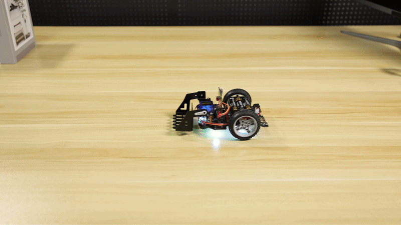
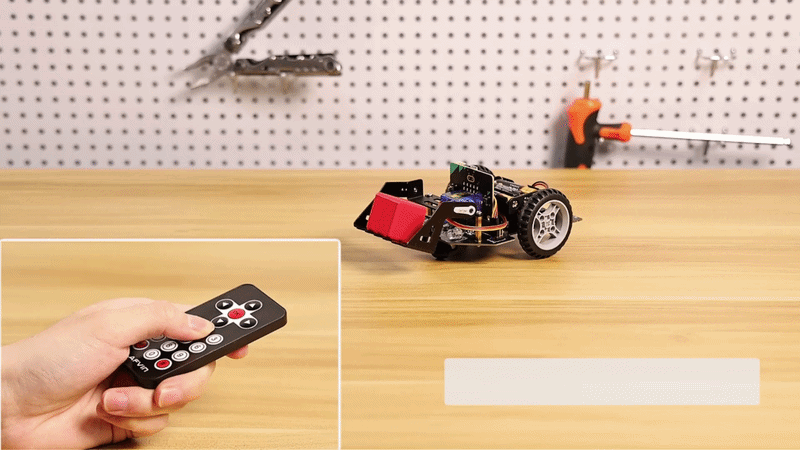

.. __Basic Courses for Cars:

Basic Courses for Cars
========================   

1. Motor Control
--------------
效果：可以控制小车前进、后退、左转、右转、左旋转、右旋转、停止等动作，并且可以设置小车的速度。
效果展示：

.. figure:: ./img/电机控制G.gif
   :align: center
   :width: 80%

makecode程序链接:
makecode图形化程序截图:

.. figure:: ./img/电机控制C.png
   :align: center
   :width: 80%

1. Music Car
--------------
效果：小车可以播放设置好的音乐。
效果展示：

.. figure:: ./img/音乐小车G.gif
   :align: center
   :width: 80%

makecode程序链接:
makecode图形化程序截图:

.. figure:: ./img/音乐小车C.png
   :align: center
   :width: 80%

1. Seven-Color Searchlight
--------------
效果：小车上安装了左右两个七彩探照灯，可以通过编程控制灯的颜色和闪烁方式。
效果展示：

.. figure:: ./img/七彩探照灯G.gif
   :align: center
   :width: 80%

makecode程序链接:
makecode图形化程序截图:

.. figure:: ./img/七彩探照灯C.png
   :align: center
   :width: 80%

1. RGB Running Light
--------------
效果：小车底部安装了四个WS2812灯，可以通过编程控制灯的颜色和闪烁方式,实现跑马灯依次变换颜色。
效果展示：

.. figure:: ./img/RGB跑马灯G.gif
   :align: center
   :width: 80%

makecode程序链接:
makecode图形化程序截图:

.. figure:: ./img/RGB跑马灯C1.png
   :align: center
   :width: 80%
.. figure:: ./img/RGB跑马灯C2.png
   :align: center
   :width: 80%

1. RGB Breathing Light
--------------
效果：小车底部安装了四个WS2812灯，可以通过编程控制灯的颜色和闪烁方式,实现呼吸灯效果。
效果展示：

.. figure:: ./img/RGB呼吸灯G.gif
   :align: center
   :width: 80%

makecode程序链接:
makecode图形化程序截图:

.. figure:: ./img/RGB呼吸灯C.png
   :align: center
   :width: 80%

1. Light Tracking
--------------
效果：MicroBit自带环境光传感器，可以通过编程控制小车根据光线的强弱来调整行驶速度，实现追光的效果。
效果展示：

.. figure:: ./img/追光G.gif
   :align: center
   :width: 80%

makecode程序链接:
makecode图形化程序截图:

.. figure:: ./img/追光C.png
   :align: center
   :width: 80%

1. Line Tracking
--------------
效果：小车底部安装了两个红外线传感器，可以通过编程控制小车根据地面上的黑线来调整行驶方向，实现循迹的效果。
效果展示：

.. figure:: ./img/巡线G.gif
   :align: center
   :width: 80%

makecode程序链接:
makecode图形化程序截图:

.. figure:: ./img/巡线C.png
   :align: center
   :width: 80%

1. Ultrasonic Ranging
--------------
效果：小车前部可选装了一个超声波传感器，可以通过编程控制小车测量与前方障碍物的距离，并显示在MicroBit的LED屏幕上。
效果展示：

.. figure:: ./img/超声波测距G.gif
   :align: center
   :width: 80%
makecode程序链接:
makecode图形化程序截图:

.. figure:: ./img/超声波测距C.png
   :align: center
   :width: 80%

1. Ultrasonic Obstacle Avoidance
--------------
效果：小车前部可选装了一个超声波传感器，可以通过编程控制小车测量与前方障碍物的距离，并根据距离来调整行驶方向，实现避障的效果。
效果展示：

.. figure:: ./img/超声波避障G.gif
   :align: center
   :width: 80%

makecode程序链接:
makecode图形化程序截图:

.. figure:: ./img/超声波避障C.png
   :align: center
   :width: 80%

1.  Ultrasonic Following
--------------
效果：小车前部可选装了一个超声波传感器，可以通过编程控制小车测量与前方障碍物的距离，并根据距离来调整行驶速度，实现跟随的效果。
效果展示：

.. figure:: ./img/超声波跟随G.gif
   :align: center
   :width: 80%

makecode程序链接:
makecode图形化程序截图:

.. figure:: ./img/超声波跟随C.png
   :align: center
   :width: 80%

1.  Servo Drive
--------------
效果：小车上留有舵机接口，接上舵机可以通过编程控制舵机的转动角度，实现一些特殊的动作。
效果展示：

.. figure:: ./img/舵机驱动G.gif
   :align: center
   :width: 80%

makecode程序链接:
makecode图形化程序截图:

.. figure:: ./img/舵机驱动C.png
   :align: center
   :width: 80%

1.  Integrated Demo_V1
--------------
效果：小车以我们之前学过的课程为基础，综合运用各种传感器和控制方法，实现一个集成的演示程序，可以展示小车的多种功能。（带自定义音乐教学）
效果展示：

makecode程序链接:
makecode图形化程序截图:

.. figure:: ./img/集成演示V1C.png
   :align: center
   :width: 80%

1.  Infrared Remote Control
--------------
效果：小车前部可选装了一个红外接收模块，可以通过编程控制小车接收红外遥控器的信号，并根据不同的按键来控制小车的行驶方向和速度，实现遥控的效果。（同样综合了前面的部分教程）
效果展示：

makecode程序链接:
makecode图形化程序截图:

.. figure:: ./img/红外遥控C.png
   :align: center
   :width: 80%

tips:以上课程实际同样适配于进阶叉车，但由于叉车安装空间和重量和供电需要原因，需要自行调整，或者结合其他的传感器和模块来实现更丰富的演示,接下来就请自行发挥聪明才智打造属于自己的炫酷效果。
