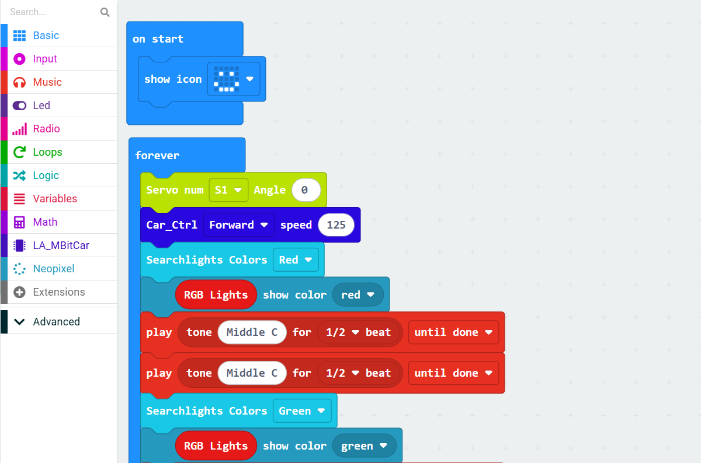
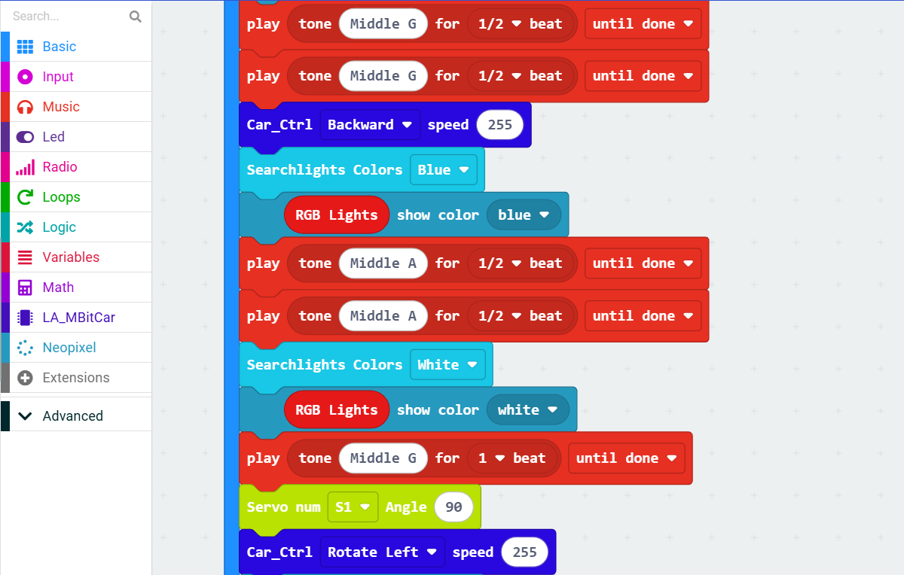
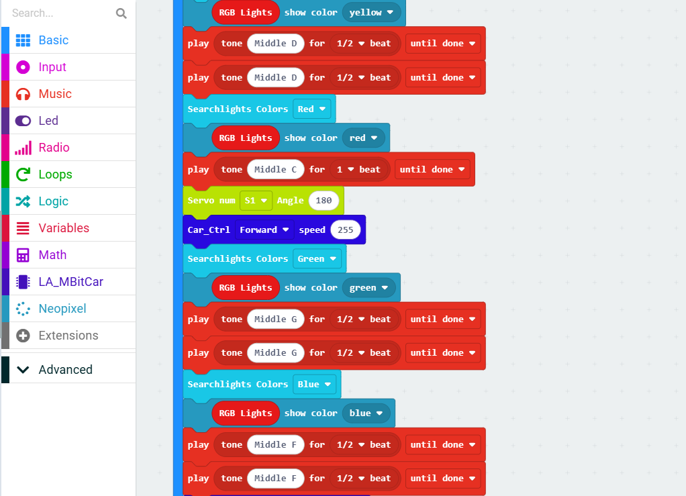
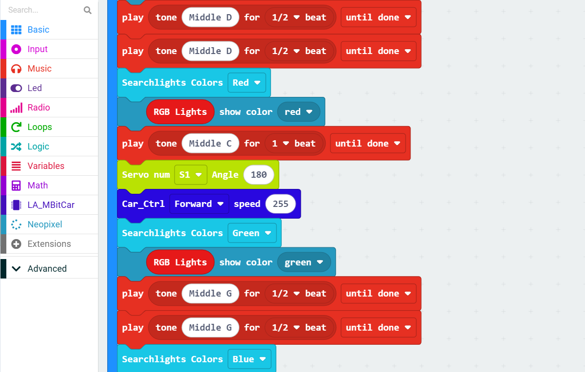
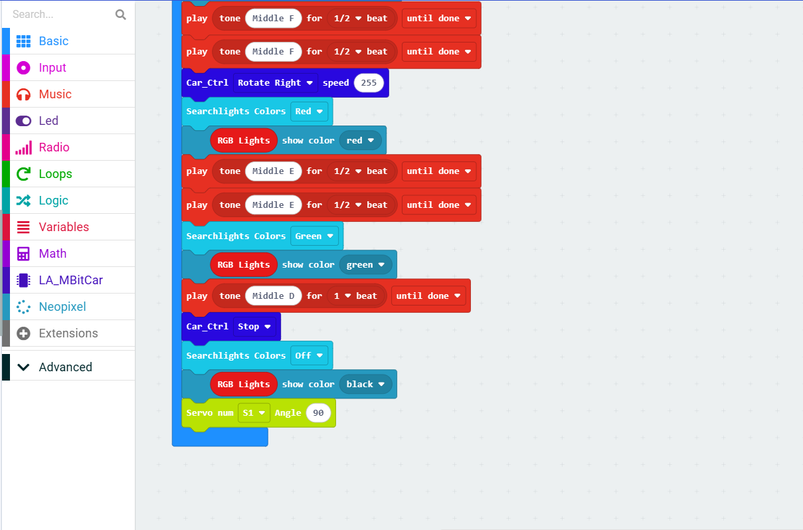
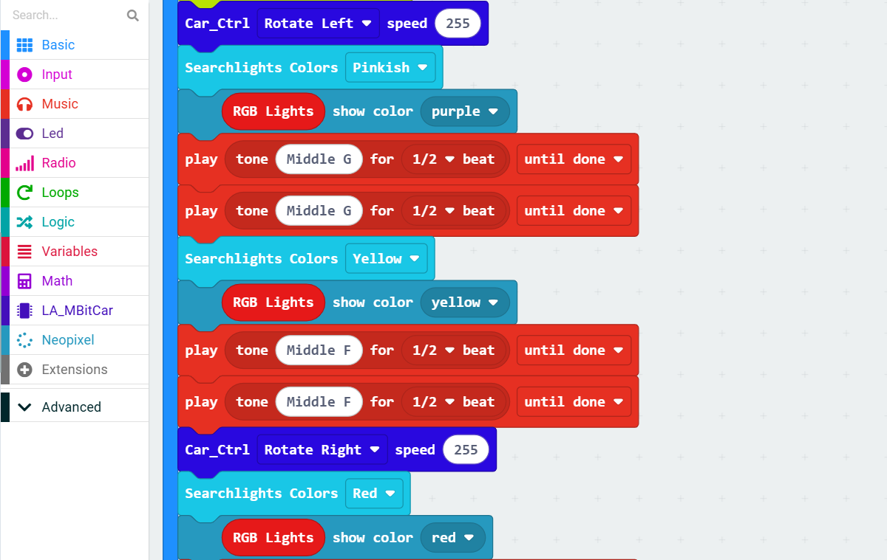
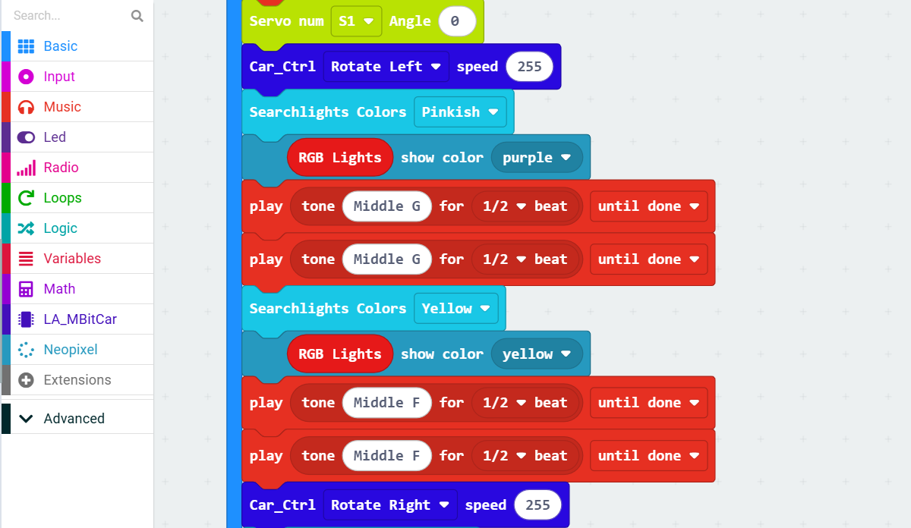
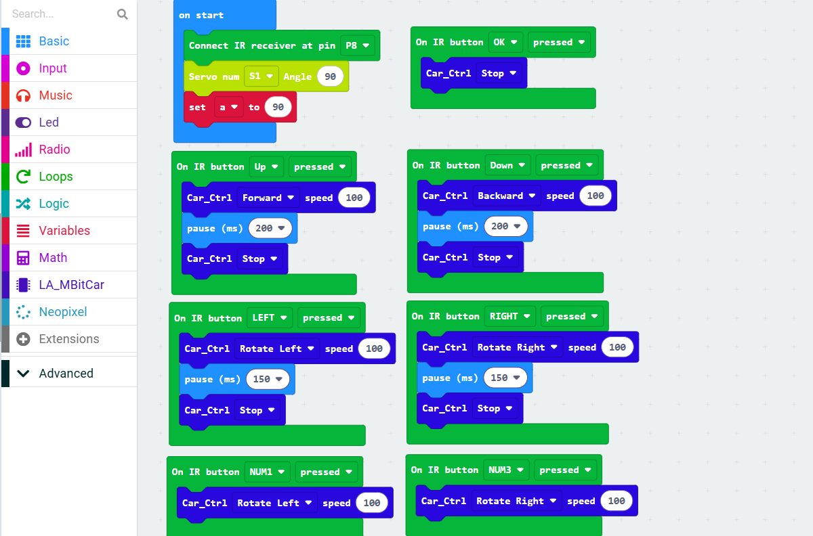
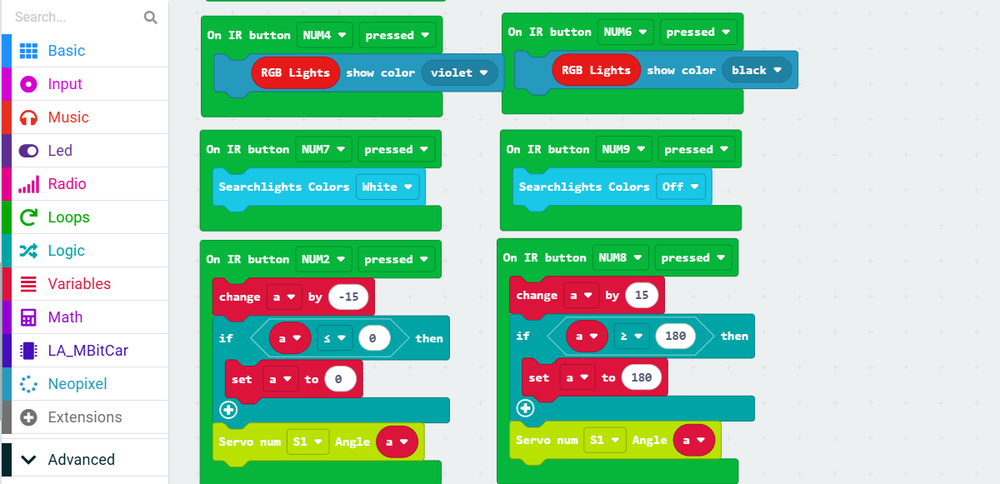
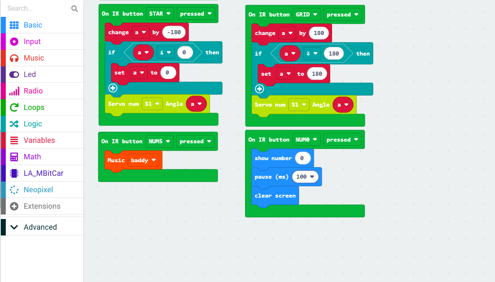

.. __Forklift Advanced:

Forklift Advanced
========================

First, we should install the forklift accessories.
The accessories are as follows:

.. figure:: ./Tutorial/img/Forklift Accessories.jpg
   :align: center
   :width: 70%

Installation video:

.. raw:: html
   
   <iframe width="560" height="315" src="https://www.youtube.com/embed/vfllj_hsUwg" title="LAFVIN ESP32 Breakout Board" frameborder="0" allow="accelerometer; autoplay; clipboard-write; encrypted-media; gyroscope; picture-in-picture; web-share" referrerpolicy="strict-origin-when-cross-origin" allowfullscreen></iframe>

12. Integrated Demo_V1
--------------
效果：小车以我们之前学过的课程为基础，综合运用各种传感器和控制方法，实现一个集成的演示程序，可以展示小车的多种功能。（带自定义音乐教学）
效果展示：

.. figure:: ./img/集成演示V1G.gif
   :align: center
   :width: 85%

makecode程序链接:
makecode图形化程序截图:

   

1.  Infrared Remote Control
--------------
效果：小车前部可选装了一个红外接收模块，可以通过编程控制小车接收红外遥控器的信号，并根据不同的按键来控制小车的行驶方向和速度，实现遥控的效果。（同样综合了前面的部分教程）
效果展示：

.. figure:: ./img/红外遥控G.gif
   :align: center
   :width: 85%

makecode程序链接:
makecode图形化程序截图:

