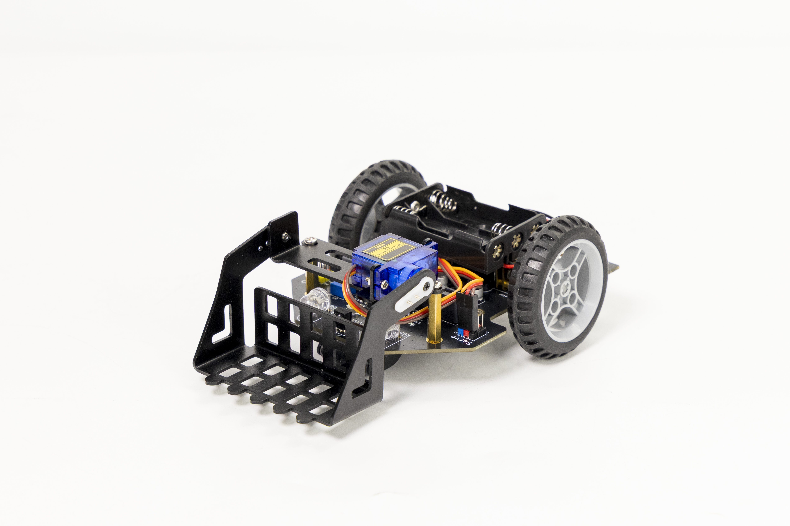
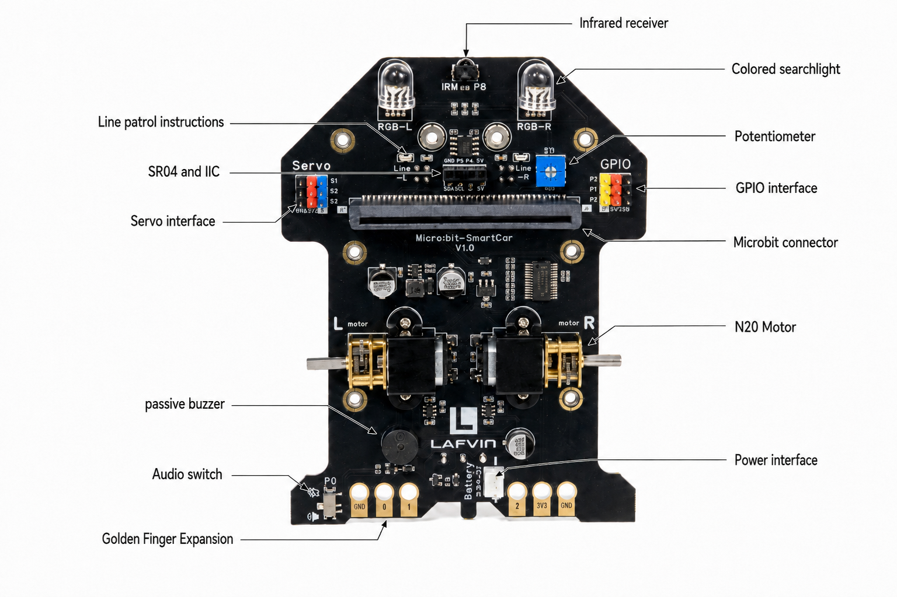
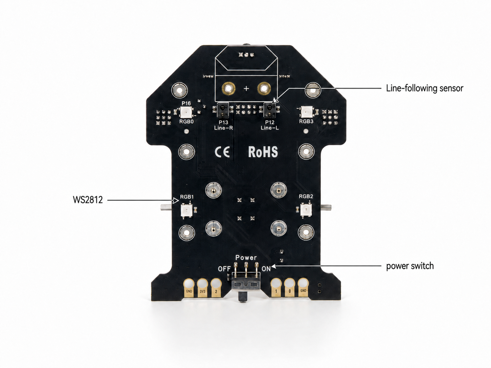

.. __about_this_kit:

About_this_kit
====================

Preface
-------------------------------

This is a modular micro:bit Smart Car designed for maker education, supporting MakeCode programming and meeting the learning needs of all stages from beginner to competition.

What You Need to Prepare
------------------------

Before assembling and programming the car, prepare:

* One **BBC micro:bit V1 or V2 board**.
* Three fresh **AAA batteries** for the battery box supplied with the kit.
* A **computer with internet access and a USB port** for using MakeCode and
  downloading programs.
* A **Micro-USB data cable** for connecting the micro:bit to the computer. A
  charge-only cable cannot transfer a program.
* If you want to use the infrared remote-control example, prepare the
  **battery required by the remote**. Check the marking inside its battery
  tray before buying one.

.. note::

   The battery box, infrared remote control, two screwdrivers, HC-SR04
   ultrasonic module, SG90 servo, and assembly hardware are supplied with the
   kit. The micro:bit and batteries are not included.

The hardware interfaces :   
-------------------------------

Product Parameters :
-------------------------------

1. Power supply voltage: 3.5V~5V DC (3 AAA dry cell batteries or 3.6V~3.7V lithium battery)
2. Line-following sensors ×2
3. Passive buzzer ×1
4. Infrared receiver (NEC encoding) ×1
5. Colored searchlights ×2
6. WS2812 RGB lights ×4
7. HC-SR04 and I2C interface (5V) × 1
8. Servo interface ×3 (S1, S2, S3)
9. GPIO interface (P0, P1, P2)
10. Golden-finger expansion interface
11. N20 motors ×2
12. Maximum motor speed: 300 rpm
13. Motor drive method: PWM motor drive
14. Programming method: makecode

Componen List
-------------------------------

.. list-table:: Componen List
   :header-rows: 1
   :widths: 10 40

   * - Qty
     - Item
   * - x1
     - Smart Car board (micro:bit not included)
   * - x1
     - Fixed wheel
   * - x2
     - Vehicle wheel
   * - x2
     - Cross axle
   * - x1
     - Triple AAA battery box
   * - x1
     - HC-SR04 ultrasonic module
   * - x1
     - Metal shovel
   * - x1
     - Servo mounting plate
   * - x1
     - SG90 servo
   * - x1
     - Metal bearing
   * - x1
     - Screw Pack
   * - x1
     - Patrol Route Map

.. tip:: For your convenience, some components come pre-installed, and spare screws and parts are included.

.. image:: /Tutorial/img/组件清单.jpg

Screw package list
-------------------------------

.. image:: /Tutorial/img/螺丝.jpg

DEMO Video
-------------------------------

Car effect demonstration:

.. raw:: html
   
   <iframe width="674" height="379" src="https://www.youtube.com/embed/eTImQBHJAHw" title="LAFVIN micro:bit Smart Car" frameborder="0" allow="accelerometer; autoplay; clipboard-write; encrypted-media; gyroscope; picture-in-picture; web-share" referrerpolicy="strict-origin-when-cross-origin" allowfullscreen></iframe>
